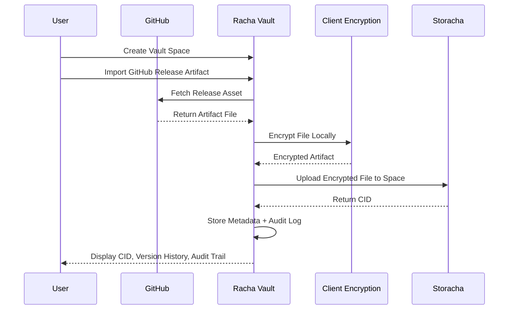

# Racha Vault

Verifiable Research and Evidence Vault built on Storacha

Racha Vault is a private, encrypted vault for research artifacts, datasets, and evidence files. It enables users to securely import, encrypt, version, and verify critical data using Storacha Spaces and CID based storage. The system prioritizes data integrity, provenance, and auditability over generic file storage.

Designed for researchers, developers, and teams that require verifiable and tamper resistant data workflows.

---

## 🚀 Core Idea

A secure vault where every artifact is:

* Encrypted before upload
* Stored on Storacha Spaces
* Versioned via CID
* Traceable through an audit trail
* Importable from real research sources such as GitHub releases

---

## 🧩 Feature Overview

| Feature                 | Description                                        | Storacha Alignment           |
| ----------------------- | -------------------------------------------------- | ---------------------------- |
| Encrypted Vault Spaces  | Private vaults for research and evidence artifacts | Uses Storacha Spaces         |
| CID Versioning          | Every upload generates immutable CID history       | Native content addressing    |
| Audit Trail Dashboard   | Track uploads, timestamps, and artifact lineage    | Verifiable data workflows    |
| GitHub Release Import   | Import datasets and artifacts from GitHub releases | Real world integration       |
| Client Side Encryption  | Files encrypted before leaving the browser         | Zero knowledge storage model |
| Artifact Categorization | Dataset, Paper, Evidence, Logs, Documents          | Research focused UX          |
| Integrity Verification  | Validate stored artifacts via CID checks           | Verifiable storage narrative |

---

## 🏗️ Tech Stack

| Layer       | Technology                                       |
| ----------- | ------------------------------------------------ |
| Frontend    | React, TypeScript, Tailwind                      |
| Storage     | Storacha Spaces (IPFS + Filecoin pipeline)       |
| Encryption  | Web Crypto API (client side AES)                 |
| Backend     | Lightweight Node API for metadata and audit logs |
| Integration | GitHub Releases API                              |

---

## 🔐 Why Storacha

Racha Vault leverages Storacha as the core storage layer to provide:

* Content addressed storage via CIDs
* Durable decentralized persistence
* Capability aligned architecture for future UCAN delegation
* Verifiable and portable data ownership

This makes it ideal for research datasets and sensitive evidence archives.

---

## 🔄 Project Flow (Sequence Diagram)

---

## 🎯 Use Cases

* Research dataset archiving
* Evidence preservation and verification
* AI experiment artifact storage
* Academic paper and supplementary file vaults
* Compliance and audit record keeping

---

## 🧪 Future Extensions

* UCAN based delegated access for team collaboration
* Lit Protocol encrypted sharing
* Private repository import via OAuth
* Multi vault team workspaces

---

## 📌 PL Genesis Submission Note

Racha Vault demonstrates a real world, non trivial integration of Storacha by focusing on verifiable research artifacts, encrypted storage pipelines, and CID based provenance tracking rather than generic file uploads or demo dashboards.
