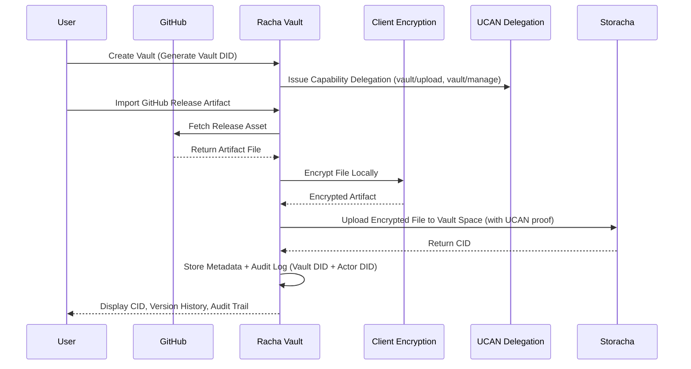

# Racha Vault

Verifiable Research and Evidence Vault built on Storacha

Racha Vault is a private, encrypted vault for research artifacts, datasets, and evidence files. It enables users to securely import, encrypt, version, and verify critical data using Storacha Spaces, UCAN capability delegation, and CID based storage. The system prioritizes data integrity, provenance, and auditability over generic file storage.

Each vault is treated as a first class entity with its own identity (Vault DID), allowing capability based access control and verifiable audit trails across solo and collaborative workflows.

Designed for researchers, developers, and teams that require verifiable and tamper resistant data workflows.

---

## 🚀 Core Idea

A secure vault where every artifact is:

* Encrypted before upload
* Stored on Storacha Spaces
* Versioned via CID
* Governed by capability based access (UCAN)
* Traceable through an audit trail
* Importable from real research sources such as GitHub releases

---

## 🧩 Feature Overview

| Feature                     | Description                                                  | Storacha Alignment             |
| --------------------------- | ------------------------------------------------------------ | ------------------------------ |
| Encrypted Vault Spaces      | Private vaults for research and evidence artifacts           | Uses Storacha Spaces           |
| Vault as Entity (Vault DID) | Each vault has its own identity and capability scope         | Capability native architecture |
| UCAN Capability Access      | Delegated permissions for vault read, upload, and management | UCAN aligned authorization     |
| CID Versioning              | Every upload generates immutable CID history                 | Native content addressing      |
| Audit Trail Dashboard       | Track uploads, timestamps, and artifact lineage              | Verifiable data workflows      |
| GitHub Release Import       | Import datasets and artifacts from GitHub releases           | Real world integration         |
| Client Side Encryption      | Files encrypted before leaving the browser                   | Zero knowledge storage model   |
| Artifact Categorization     | Dataset, Paper, Evidence, Logs, Documents                    | Research focused UX            |
| Integrity Verification      | Validate stored artifacts via CID checks                     | Verifiable storage narrative   |

---

## 🏗️ Tech Stack

| Layer         | Technology                                       |
| ------------- | ------------------------------------------------ |
| Frontend      | React, TypeScript, Tailwind                      |
| Storage       | Storacha Spaces (IPFS + Filecoin pipeline)       |
| Authorization | UCAN (Capability Delegation Model)               |
| Encryption    | Web Crypto API (client side AES-GCM)             |
| Backend       | Lightweight Node API for metadata and audit logs |
| Integration   | GitHub Releases API                              |

---

## 🪪 Vault Identity & Capability Model

Racha Vault follows a vault-as-entity architecture:

* Each vault is assigned a unique Vault DID
* Users interact with vaults through UCAN delegations
* Capabilities are scoped (read, upload, manage)
* Audit logs reflect both actor DID and vault DID

This model enables:

* Cryptographic access control instead of role based auth
* Clean collaboration without redesigning storage logic
* Strong alignment with Storacha’s capability based ecosystem

---

## 🔐 Why Storacha

Racha Vault leverages Storacha as the core storage layer to provide:

* Content addressed storage via CIDs
* Durable decentralized persistence
* Native compatibility with UCAN delegation workflows
* Space based logical isolation for vault entities
* Verifiable and portable data ownership

This makes it ideal for research datasets, sensitive evidence archives, and provenance critical artifacts.

---

## 🔄 Project Flow (Sequence Diagram)

---

## 🎯 Use Cases

* Research dataset archiving
* Evidence preservation and verification
* AI experiment artifact storage
* Academic paper and supplementary file vaults
* Compliance and audit record keeping

---

## 🧪 Future Extensions

* Multi collaborator vaults with fine grained UCAN delegations
* Lit Protocol encrypted sharing and revocation
* Private repository import via OAuth
* CLI uploader for research pipelines
* Advanced provenance visualization and audit analytics

---

## 📌 PL Genesis Submission Note

Racha Vault demonstrates a real world, non trivial integration of Storacha by combining encrypted artifact pipelines, Vault DID based capability control (UCAN), GitHub research artifact ingestion, and CID based provenance tracking rather than generic file upload dashboards or trivial storage demos.
