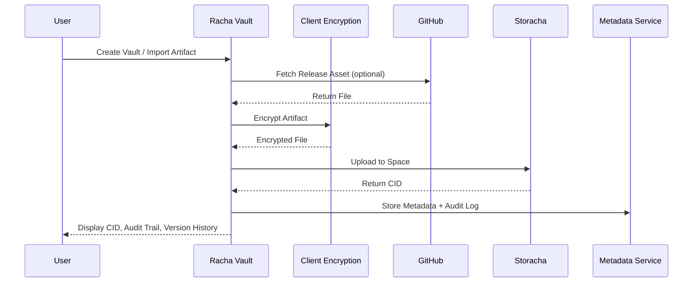

# Architecture: Racha Vault

## 1. System Overview

Racha Vault is a verifiable, encrypted research and evidence vault built on Storacha Spaces. The system is designed to securely ingest artifacts (local files or GitHub release assets), encrypt them client-side, store them on decentralized storage, and maintain a CID-based audit trail for integrity and provenance.

The architecture follows a storage-first model where:

* Files are encrypted before upload
* Encrypted artifacts are stored on Storacha
* CIDs act as immutable references
* Metadata and audit logs are indexed separately

This ensures zero-knowledge storage with verifiable data integrity.

---

## 2. Core Architecture Components

### 2.1 Frontend (Vault Application)

Responsible for:

* Vault creation and management
* Artifact uploads and imports
* Encryption handling (client-side)
* Audit trail visualization
* CID version history display

Tech: React, TypeScript, Tailwind

---

### 2.2 Encryption Layer (Client-Side)

All artifacts are encrypted in the browser before being uploaded to Storacha.

Key characteristics:

* AES-GCM encryption via Web Crypto API
* Zero plaintext exposure to backend or storage layer
* Local key handling for MVP (no external key custody)

This aligns with a zero-knowledge storage model.

---

### 2.3 Storage Layer (Storacha)

Storacha acts as the primary decentralized storage infrastructure.

Responsibilities:

* Store encrypted artifacts in Spaces
* Generate immutable CIDs for each upload
* Provide durable and verifiable persistence (IPFS + Filecoin pipeline)

Each vault maps logically to a Storacha Space.

---

### 2.4 Metadata & Audit Service (Light Backend)

A lightweight backend indexes non-sensitive metadata only.

Stored data includes:

* Artifact name
* CID hash
* Vault ID
* Source (Local or GitHub)
* Timestamps
* Version lineage

Important:
No raw files or encryption keys are stored on the backend.

---

### 2.5 GitHub Integration Layer

Racha Vault integrates with the GitHub Releases API to import research artifacts and datasets directly from public repositories.

Scope:

* Fetch release assets
* Select dataset or artifact files
* Import and encrypt before storage

This enables real-world research provenance workflows.

---

## 3. Data Flow Pipeline

Primary artifact ingestion flow:

1. User selects local file or GitHub release asset
2. File is encrypted client-side
3. Encrypted artifact is uploaded to Storacha Space
4. Storacha returns a CID
5. Metadata and audit entry are recorded
6. Vault dashboard displays CID, version history, and integrity status

---

## 4. Sequence Flow (High-Level)

---

## 5. Vault & Artifact Model

### Vault

A logical container representing:

* Research project
* Evidence archive
* Dataset repository

Each vault:

* Maps to a Storacha Space (logical association)
* Maintains its own artifact history and audit logs

### Artifact

An artifact represents:

* Dataset
* Paper
* Evidence file
* Experiment log
* Document

Each artifact:

* Is encrypted before storage
* Has a unique CID per version
* Maintains immutable version lineage

---

## 6. CID Versioning Strategy

Racha Vault uses content addressing for version control.

Characteristics:

* Every upload generates a new CID
* Previous versions remain immutable
* Version history is traceable through audit logs
* Integrity can be verified via CID comparison

This provides tamper-evident research provenance.

---

## 7. Security Model

### 7.1 Encryption

* Client-side encryption (AES-GCM)
* No plaintext stored on server or storage layer

### 7.2 Key Handling (MVP)

* Keys generated locally per session or vault
* Stored client-side for initial version
* Export/import key support planned for multi-device use

### 7.3 Zero-Knowledge Storage

Storacha stores only encrypted blobs.
The system never exposes raw research artifacts to backend services.

---

## 8. Integration Design Rationale

### Why Storacha

* Content addressed storage (CID integrity)
* Decentralized persistence
* Space-based logical organization
* Alignment with verifiable data workflows

### Why GitHub Releases Integration

* Real research datasets are often distributed via releases
* Enables provenance-aware artifact ingestion
* Avoids heavy repository cloning complexity
* Keeps focus on research artifacts, not source control

---

## 9. Future Extensibility (Post-MVP)
* Lit Protocol for encrypted shared vaults
* Private repository import via OAuth
* CLI uploader for research pipelines
* Advanced audit analytics and provenance graphs
