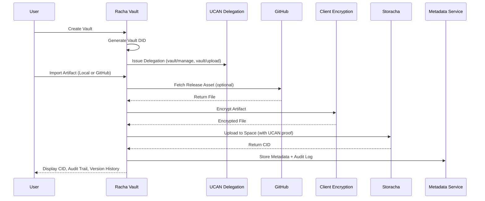

# Architecture: Racha Vault

## 1. System Overview

Racha Vault is a verifiable, encrypted research and evidence vault built on Storacha, designed around a vault-as-entity architecture. Each vault is treated as a first class identity (Vault DID) with capability scoped access using UCAN delegations.

The system enables secure ingestion of research artifacts (local files or GitHub release assets), client-side encryption, decentralized storage on Storacha Spaces, and CID-based provenance tracking through an auditable metadata layer.

Core architectural principles:

* Vault-centric identity model (Vault DID)
* Capability-based authorization (UCAN)
* Client-side encryption (zero-knowledge)
* CID-based immutable versioning
* Verifiable audit trails
* Real-world artifact ingestion (GitHub Releases)

---

## 2. Core Architecture Components

### 2.1 Frontend (Vault Application)

The frontend acts as the primary orchestration layer for vault operations and user interactions.

Responsibilities:

* Vault creation and management
* Artifact upload and GitHub import
* Client-side encryption handling
* UCAN delegation handling and proof usage
* Audit trail and version history visualization

Tech Stack: React, TypeScript, Tailwind

---

### 2.2 Vault Identity Layer (Vault DID Model)

Racha Vault implements a vault-as-entity architecture where each vault is assigned a unique decentralized identifier (Vault DID).

Key properties:

* Vault has its own DID independent of the user
* Vault acts as the capability scope boundary
* Users interact with vaults via UCAN delegations
* Audit logs reference both Vault DID and Actor DID

This enables cryptographically verifiable ownership and clean collaboration without relying on traditional role-based access systems.

---

### 2.3 Authorization Layer (UCAN Capability Model)

Authorization is handled through UCAN (User Controlled Authorization Network) delegations rather than centralized role-based access control.

Capability examples:

* vault/read
* vault/upload
* vault/manage
* vault/audit/write

Flow:

* Vault issues delegations to user DIDs
* Users present UCAN proofs when performing operations
* Operations are validated against scoped capabilities

This aligns natively with Storacha’s capability-driven ecosystem design.

---

### 2.4 Encryption Layer (Client-Side)

All artifacts are encrypted in the client before being uploaded to decentralized storage.

Security characteristics:

* AES-GCM encryption via Web Crypto API
* No plaintext exposure to backend or storage layers
* Zero-knowledge storage model
* Local key generation per vault (MVP)

This ensures sensitive research artifacts and evidence files remain private even when stored on decentralized infrastructure.

---

### 2.5 Storage Layer (Storacha Spaces)

Storacha serves as the primary decentralized storage backend for encrypted artifacts.

Responsibilities:

* Store encrypted blobs in Spaces
* Generate content identifiers (CIDs)
* Provide durable persistence via IPFS + Filecoin pipeline
* Support capability-aligned storage workflows

Each vault is logically mapped to a Storacha Space, reinforcing isolation and provenance tracking.

---

### 2.6 Metadata & Audit Service (Light Backend)

A lightweight backend indexes non-sensitive metadata and maintains audit logs.

Stored metadata includes:

* Artifact name
* CID hash
* Vault DID
* Actor DID
* Source (Local or GitHub)
* Timestamps
* Version lineage

Important constraint:
No raw files, encryption keys, or sensitive payloads are stored on the backend.

---

### 2.7 GitHub Integration Layer

Racha Vault integrates with the GitHub Releases API to support provenance-aware artifact ingestion.

Scope of integration:

* Fetch public release assets
* Import datasets, archives, and research artifacts
* Tag artifacts with source metadata
* Encrypt before decentralized storage

This avoids heavy repository cloning while supporting real research workflows.

---

## 3. End-to-End Data Flow

Primary artifact ingestion pipeline:

1. User creates a vault (Vault DID generated)
2. UCAN delegation issued to user DID with scoped capabilities
3. User uploads local artifact or imports GitHub release asset
4. Artifact encrypted client-side
5. Encrypted artifact uploaded to Storacha Space with UCAN proof
6. Storacha returns CID
7. Metadata and audit entry recorded (Vault DID + Actor DID)
8. Vault dashboard displays CID, version history, and audit trail

---

## 4. Sequence Flow (High-Level)

---

## 5. Vault & Artifact Data Model

### Vault

A vault is a first-class entity representing:

* Research project
* Evidence archive
* Dataset repository

Attributes:

* Vault DID
* Associated Storacha Space
* Delegation records
* Artifact index

---

### Artifact

Artifacts represent domain-specific research and evidence files such as:

* Datasets
* Papers
* Evidence files
* Experiment logs
* Documents

Each artifact:

* Is encrypted before storage
* Generates a unique CID per version
* Maintains immutable version lineage
* Is linked to both Vault DID and Actor DID

---

## 6. CID Versioning Strategy

Racha Vault uses content addressing as the core version control mechanism.

Characteristics:

* Each upload produces a new CID
* Historical versions remain immutable
* Version lineage tracked via metadata and audit logs
* Integrity verifiable through CID comparison

This creates a tamper-evident provenance layer for research artifacts.

---

## 7. Security Model

### 7.1 Zero-Knowledge Storage

* All files encrypted before upload
* Storacha stores only encrypted blobs
* Backend never accesses plaintext artifacts

---

### 7.2 Key Handling (MVP)

* Keys generated client-side per vault
* Stored locally (export/import planned)
* No centralized key custody

---

### 7.3 Capability Security

* UCAN scoped delegations per vault
* Cryptographic proof of permissions
* No reliance on traditional RBAC systems

---

## 8. Design Rationale

### Why Vault-as-Entity (Vault DID)

* Enables clean collaboration model
* Supports delegation without redesign
* Improves audit traceability
* Aligns with decentralized identity principles

---

### Why UCAN Instead of Role-Based Auth

* Fine-grained capability control
* Delegation chains for collaboration
* Native alignment with Storacha ecosystem
* Cryptographically verifiable permissions

---

### Why Storacha

* Content addressed storage (CID integrity)
* Decentralized persistence
* Space-based logical isolation
* Capability-aligned architecture

---

## 9. Future Architectural Extensions

* Multi-collaborator vaults with revocable delegations
* Lit Protocol for encrypted shared access
* Private repository import via OAuth
* CLI ingestion pipelines for research datasets
* Advanced provenance graph visualization
